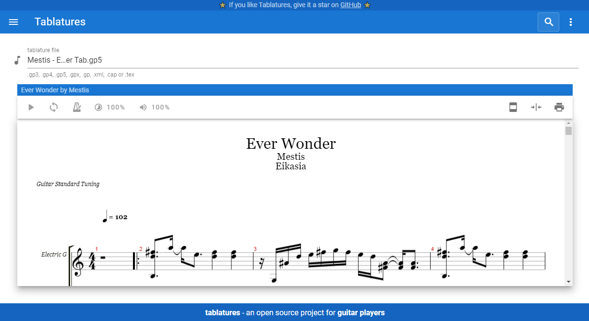

# Tablatures

Read and play tabs quickly

- **Import a music score** (`.gp3`, `.gp4`, `.gp5`, `.gpx`, `.gp`, `.xml`, `.cap` or `.tex`)
- **Browse the tabs database** (`IN DEV`)
- **Browse documentation** (`IN DEV`)

The website is currently under heavy development and can be unstable. Do not hesitate to report issues at [here](https://github.com/mlhoutel/Tablatures/issues).

**Browse the website now:** https://mlhoutel.github.io/Tablatures/

## Getting started

### Clone and install

1. clone the project `git clone https://github.com/mlhoutel/Tablatures.git`
2. fetch the dependancies `cd Tablatures && npm i`
3. launc with hot-reload `npm run dev`

### Build and deploy

1. build the website `npm run build`
2. run on server `npm run serve`

## Made with

- Vite: https://github.com/vitejs/vite
- VueJs: https://github.com/vuejs/vue
- Vuetify: https://github.com/vuetifyjs/vuetify
- AlphaTab: https://github.com/CoderLine/alphaTab