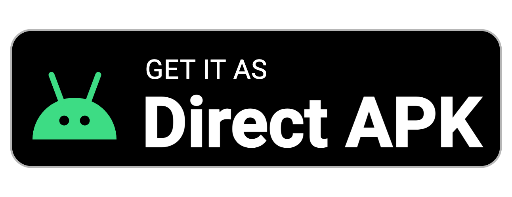

# Tablatures

<a href="https://tablatures.github.io/tablatures" >
    
</a>

<a href="https://github.com/tablatures/tablatures/blob/main/package.json" >
    
</a>

<a href="https://github.com/tablatures/tablatures/search?l=svelte" >
    
</a>

<a href="https://github.com/tablatures/tablatures/blob/main/LICENSE/" >
    
</a>

&nbsp;&nbsp;

<p align="center">
  <a href="https://tablatures.github.io/tablatures/"></a>
</p>

&nbsp;&nbsp;

**The YouTube of guitar tablatures**: search, play, and practice guitar tabs with a modern web player.

## Install

**Web / PWA:** open [tablatures.github.io/tablatures](https://tablatures.github.io/tablatures) in any modern browser and choose *Install app* / *Add to Home Screen*. The installed app works offline (tabs you import, playback with the bundled soundfont) on Android, desktop and iOS.

<!-- Uncomment once the first Android release is published and listed.

**Android:** install from F-Droid, download the APK directly, or use Obtainium for auto-updates from GitHub Releases.

<p>
  <a href="https://f-droid.org/packages/org.tablatures.app/">
    
  </a>
  <a href="https://github.com/tablatures/tablatures/releases/latest/download/tablatures.apk">
    
  </a>
  <a href="https://apps.obtainium.imranr.dev/redirect?r=obtainium%3A%2F%2Fapp%2F%257B%2522id%2522%253A%2522org.tablatures.app%2522%252C%2522url%2522%253A%2522https%253A%252F%252Fgithub.com%252Ftablatures%252Ftablatures%2522%252C%2522author%2522%253A%2522tablatures%2522%252C%2522name%2522%253A%2522Tablatures%2522%252C%2522additionalSettings%2522%253A%2522%257B%255C%2522apkFilterRegEx%255C%2522%253A%255C%2522tablatures-.*%255C%255C%255C%255C.apk%255C%2522%252C%255C%2522invertAPKFilter%255C%2522%253Afalse%257D%2522%257D">
    
  </a>
</p>

-->

## Features

### Player
- **alphaTab-powered rendering** of Guitar Pro files (`.gp3`, `.gp4`, `.gp5`, `.gpx`, `.gp`, `.xml`)
- **Persistent mini-player**: audio continues playing across page navigation with a floating tab preview
- **YouTube video sync**: play along with YouTube videos, with bidirectional playback sync and adjustable time offset
- **Drag-to-loop**: drag on the progress bar or the tablature sheet to create A-B loop regions with floating controls
- **Smart cursor follow**: auto-scrolls with the cursor, pauses when you scroll away, resumes when you scroll back
- **Versions & sources**: switch between the same song's versions and sources (Songsterr, Ultimate Guitar, …) without leaving the player
- **Player queue**: play through a playlist or album, with prev/next and a jump-to-track list
- **Dark theme support**: proper alphaTab color theming with dark mode
- **Track mixer**: solo, mute, and adjust volume per track
- **Keyboard shortcuts**: Space, arrows, +/-, and more

### Search & Discovery
- **Multi-source search**: searches local database, Songsterr, and Ultimate Guitar in parallel
- **Dedicated search page** (`/search?q=...`) with shareable URLs
- **Artist hero banner**: fuzzy-matched artist detection with image, bio, country, and genre tags
- **Artist pages** (`/artist/[name]`): top tabs, albums, similar artists, and the full tab list for an artist
- **Album artwork**: fetched from iTunes for search results, favorites, and the player
- **Artist tooltips**: hover any artist name to see their photo, bio, and a link to search their tabs
- **Autocomplete** with section headers (songs first, then albums, then artists)

### Repertoire & Playlists
- **Favorite songs** with album artwork, grouped by artist
- **Favorite artists** with follow/unfollow from tooltips and hero banners
- **History** grouped by day with individual item removal
- **Playlists**: create, edit, and reorder playlists; share them via a URL and load them straight into the player queue
- **Preferences**: soundfont selection, default speed/metronome, data export/import
- **Local-first data**: favorites, history, playlists, and preferences live only in your browser (localStorage) and are never uploaded. Search, tab downloads, album artwork, and recommendations are served by the Search API.

### Player Controls
- **YouTube-style volume**: icon + hover slider with violet fill
- **Speed selector**: shows custom values when adjusted with +/- keys
- **Unified settings panel**: single button for tracks and settings
- **Video picker**: choose from YouTube results, plays inline with sync
- **Share**: URLs include tab ID, video ID, and playback time for easy sharing

## Routes

| Route | Description |
|-------|-------------|
| `/` | Home: discovery feed with recommendations, recent tabs, import |
| `/search?q=...` | Search results with artist hero section |
| `/play?tab=...&video=...&track=...&t=...` | Full player with shareable state (tab, video, active track, playback time) |
| `/artist/[name]` | Artist page: top tabs, albums, similar artists, and all tabs |
| `/repertoire` | Your collection: `favorites` \| `history` \| `playlists` tabs |
| `/playlist` | A single playlist: saved, shared (via URL), or the live player queue |
| `/settings` | Soundfont presets, default speed/metronome, data export/import |

## Getting Started

```bash
# Clone and install
git clone https://github.com/tablatures/tablatures.git
cd tablatures && pnpm install

# Development
pnpm run start

# Build
pnpm run build
pnpm run preview
```

## Android app (Capacitor)

The Android app wraps the same static build in a Capacitor 8 WebView shell.

```bash
# Build the web assets at the root base path, then sync into android/
pnpm run build:app
pnpm exec cap sync android

# Debug build / run (needs JDK 21 and the Android SDK)
cd android && ./gradlew assembleDebug
```

### Release signing

Tagging a commit `v*` runs `.github/workflows/android-release.yml`, which builds a
signed release APK and attaches `tablatures-<tag>.apk` to a GitHub Release. The
`versionName` is the tag without the leading `v`; the `versionCode` is the
workflow run number.

You create the keystore and secrets yourself (they are never committed):

```bash
# 1. Generate a keystore ONCE and keep it safe. Never rotate it, or installed
#    apps can no longer update.
keytool -genkeypair -v -keystore release.keystore -alias tablatures \
    -keyalg RSA -keysize 2048 -validity 10000

# 2. Base64-encode it for the GitHub secret
base64 -i release.keystore | tr -d '\n' > release.keystore.base64
```

Then add these repository secrets (Settings > Secrets and variables > Actions):

| Secret | Value |
|--------|-------|
| `ANDROID_KEYSTORE_BASE64` | contents of `release.keystore.base64` |
| `ANDROID_KEYSTORE_PASSWORD` | the store password |
| `ANDROID_KEY_ALIAS` | the key alias (e.g. `tablatures`) |
| `ANDROID_KEY_PASSWORD` | the key password |

Without these secrets, a local `./gradlew assembleRelease` falls back to the debug
signing key so the build still succeeds.

## Environment Variables

The Tablatures frontend uses environment variables to configure API endpoints, deployment behavior, and runtime options. These must be defined in your environment (e.g., `.env` files, CI/CD, or hosting platform settings).

| Variable | Description | Example |
|----------|------------|--------|
| `VITE_SEARCH_API_BASE_URL` | Base URL for the Search API used by the frontend | `https://example.com` |
| `VITE_SEARCH_API_TIMEOUT` | Timeout for Search API requests (milliseconds) | `10000` |
| `VITE_DEPLOY_TARGET` | Deployment target: `'static'` for static hosting, `'server'` for SSR | `static` |
| `VITE_BASE_PATH` | Base path for frontend URLs (for GitHub Pages or repo subpaths) | `/tablatures` |

> **Note:** All frontend environment variables must start with `VITE_` to be accessible in the browser.

## Tech Stack

- **SvelteKit** + TypeScript
- **Tailwind CSS** for styling
- **alphaTab 1.8.1** for tablature rendering and playback
- **YouTube iFrame API** for video sync
- **Vite** for building
