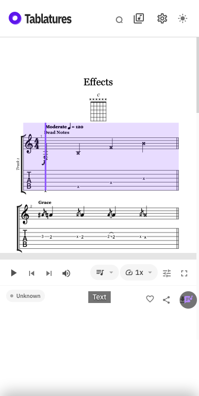
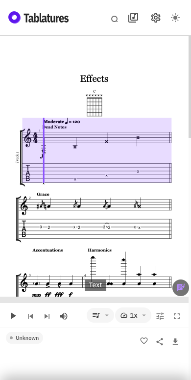

# Player display regression evidence

The screenshots come from the same mocked GP5 fixture in Playwright WebKit:
390 × 844 (phone) and 1280 × 800 (desktop). They show the icon clipping before
and after the shared line-height correction. The baseline uses main commit
`538a39a6e57b508606b81ff8daddb827b9102b65`'s icon styles; viewport-settling work
was already present during capture. These are browser test captures, not
recordings of physical iPhone Chrome or its address bar animation.

| | Before | After |
| --- | --- | --- |
| Phone |  |  |
| Desktop |  |  |

Reproduce captures with the optional `CAPTURE_LABEL=before` or
`CAPTURE_LABEL=after` environment variable when running
`tests/player-display-regressions.spec.ts`. Images are written under `/tmp`.

The new WebKit regressions reproduced a 1503 px phone / 887 px desktop scroll
offset after replacing a score that had been sought to 55%, even though the new
score's playback position was already back at its first bar. The tests now
sample the first second of the new score, requiring no inherited scroll and
zero playback time, including replacement versions with the same song title.

The viewport regressions simulate a height that settles after its resize
event, restoration via `pageshow`, and returning from a hidden app without a
resize event. Those simulations reproduce the stale-height failure but do not
establish which events a particular iOS Chrome version emits. Physical-device
verification of browser toolbar expansion/collapse remains necessary.

## Device follow-up

An iPhone recording on Chrome 154.0.8037.55 still shows a persistent gap after
scrolling the catalogue to collapse the browser controls, then opening a score.
The simulated delayed-metric tests do not reproduce this native browser state.
The toolbar-gap fix is therefore **not verified on the affected device**.

The subsequent device report identifies a 110px discrepancy: the catalogue
reports 775px while Chrome's toolbar is collapsed, but opening `/play` changes
`innerHeight`, `visualViewport.height` and `100dvh` to 665px. `100lvh` remains
775px. The controls retain 34px of safe-area padding until the user touches the
browser header, when the padding becomes zero without any API height change.
The report also catches a transient 685px viewport offset inherited from the
catalogue scroll position.

The follow-up uses the large CSS viewport only on iPhone Chrome, when the bottom
safe area is exposed and the reported height incorrectly equals the small
viewport. It observes safe-area changes, preserves keyboard/zoom sizing, and
bounds impossible unzoomed viewport offsets. This is a device-report-based
workaround; confirmation on physical Chrome remains pending.

| Simulated device measurements | Before | After |
| --- | --- | --- |
| 775px visible area, 665px reported height, 34px bottom safe area |  |  |

These screenshots replay the reported measurements in Playwright WebKit; they
do **not** capture native Chrome. The baseline disables the safe-area fallback
while keeping the same 34px control padding. Reproduce both with
`CAPTURE_LABEL=after` when running `tests/mobile-player-viewport.spec.ts`.

Opening the preview with `?viewportDebug=1` enables a lazy-loaded “Viewport
report” button that stays available across client navigation. Reproduce the
gap, wait a second, then touch Chrome's address bar as usual to correct it.
Open “Viewport report” and copy the report. It records viewport APIs, CSS small/dynamic/large
viewport heights, bottom safe area, player geometry, and the preceding route/viewport events.
The preceding measurements include both broken and corrected states.
Reports are copied manually; nothing is uploaded, and
URL query parameters / tab IDs are excluded. Ordinary visits load no reporter.

Related browser reports describe [stale viewport metrics after toolbar
collapse](https://issues.chromium.org/issues/490150189) and [a compositing offset
invisible to JavaScript](https://issues.chromium.org/issues/558766777). They are
diagnostic leads, not proof that this device has the same browser defect.
