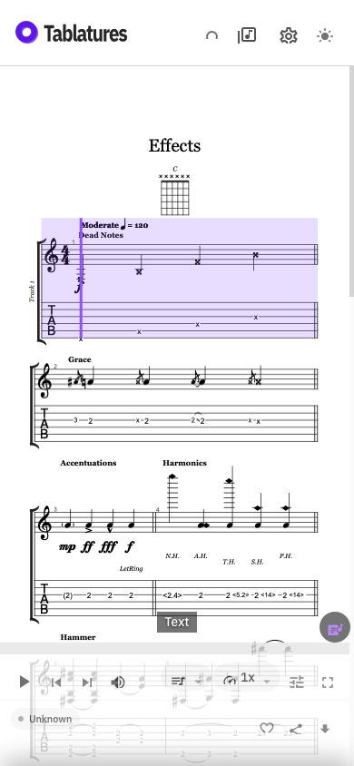
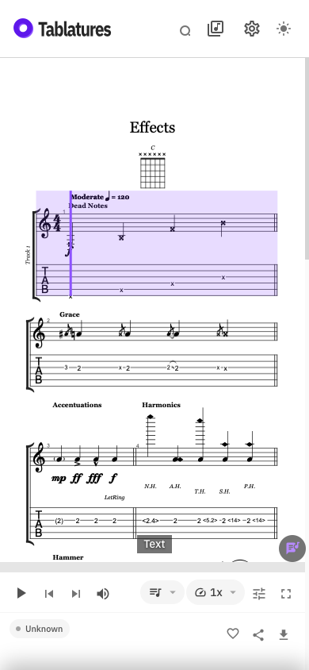
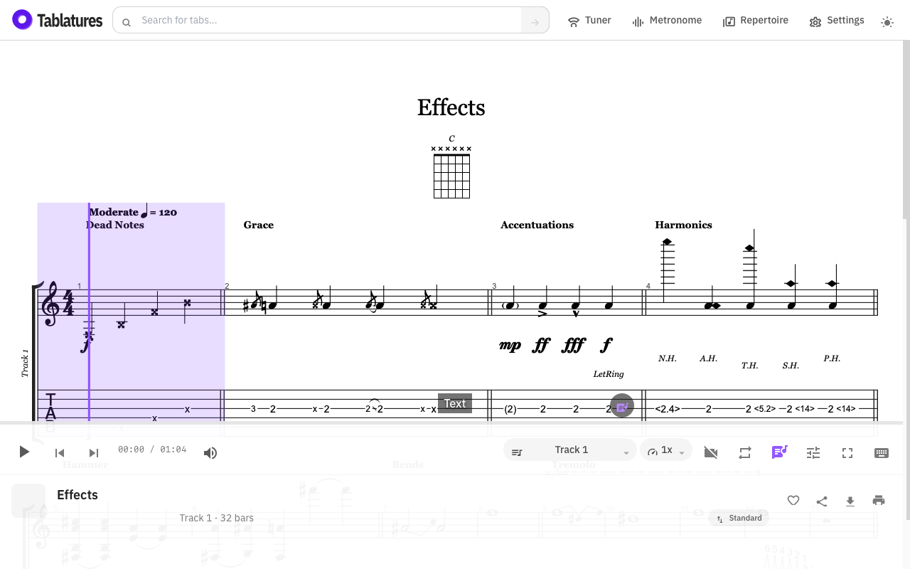
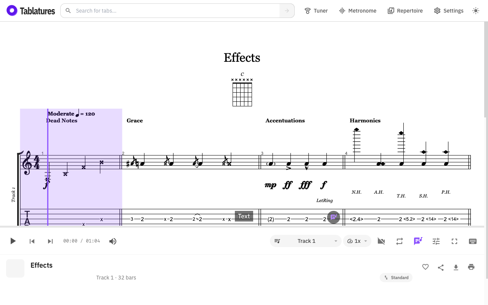

# Player display regression evidence

The screenshots come from the same mocked GP5 fixture in Playwright WebKit:
390 × 844 (phone) and 1280 × 800 (desktop). They show the icon clipping before
and after the shared line-height correction. The baseline uses main commit
`538a39a6e57b508606b81ff8daddb827b9102b65`'s icon styles; viewport-settling work
was already present during capture. These are browser test captures, not
recordings of physical iPhone Chrome or its address bar animation.

| | Before | After |
| --- | --- | --- |
| Phone |  |  |
| Desktop |  |  |

Reproduce captures with the optional `CAPTURE_LABEL=before` or
`CAPTURE_LABEL=after` environment variable when running
`tests/player-display-regressions.spec.ts`. Images are written under `/tmp`.

The new WebKit regressions reproduced a 1503 px phone / 887 px desktop scroll
offset after replacing a score that had been sought to 55%, even though the new
score's playback position was already back at its first bar. The tests now
sample the first second of the new score, requiring no inherited scroll and
zero playback time, including replacement versions with the same song title.

The viewport regressions simulate a height that settles after its resize
event, restoration via `pageshow`, and returning from a hidden app without a
resize event. Those simulations reproduce the stale-height failure but do not
establish which events a particular iOS Chrome version emits. Physical-device
verification of browser toolbar expansion/collapse remains necessary.
